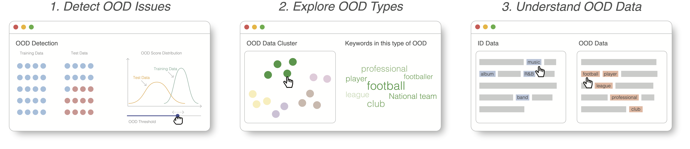

# DeepLens: Interactive Out-of-distribution Data Detection in NLP Models



DeepLens is an interactive system that helps users detect and explore OOD issues in massive text corpora.
This repository contains the official implementation of our related paper:

[**DeepLens: Interactive Out-of-distribution Data Detection in NLP Models**](https://arxiv.org/abs/2303.01577)

*Da Song\*, Zhijie Wang\*, Yuheng Huang, Lei Ma, Tianyi Zhang* (\* Authors contributed equally to this research)

2023 ACM CHI Conference on Human Factors in Computing Systems (CHI 2023)

## Getting Started

If you only want to try our tool with provided settings, you can easily follow the instruction below to setup.

If you want to use DeepLens with your own example, please follow the folder `ml_python` for more details.

### Environments Set-up

#### NPM >= 7 

~~~sh
$ cd dashboard
$ npm install
~~~

### Basic Usage

#### Quick start

~~~sh
$ npm start
~~~
Copy the url and open it in browser.

## Citation

If you found our paper/code useful in your research, please consider citing:

```
@inproceedings{song2023deeplens,
 author = {Song, Da and Wang, Zhijie and Huang, Yuheng and Ma, Lei and Zhang, Tianyi}, 
 title = {DeepLens: Interactive Out-of-Distribution Data Detection in NLP Models}, 
 year = {2023}, 
 isbn = {9781450394215}, 
 publisher = {Association for Computing Machinery}, 
 address = {New York, NY, USA}, 
 doi = {10.1145/3544548.3580741},
 booktitle = {Proceedings of the 2023 CHI Conference on Human Factors in Computing Systems}, 
 articleno = {739}, 
 numpages = {17}, 
 location = {Hamburg, Germany}, series = {CHI '23}
} 
```

## License

This project is released under the [MIT license](https://github.com/momentum-lab-workspace/DeepSeer/blob/main/LICENSE.MD).

## Acknowledgement

Special thanks to our pilot study participants for helping us improve DeepLens.
